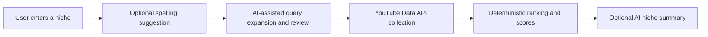

# NicheRadar portfolio repository outline

Use this as the README for a future public `NicheRadar-portfolio` repository.
Do not copy private source, environment files, database exports, API keys, or
real user/analysis data into that repository.

## NicheRadar

One paragraph on the problem: turning recent public YouTube Shorts metadata
into a structured research snapshot for creators evaluating a niche.

## Screenshots

- `[Landing and query review screenshot]`
- `[Analysis dashboard screenshot]`
- `[Niche Summary screenshot]`

## Architecture and method

## Stack

- FastAPI, SQLAlchemy, PostgreSQL in deployed environments
- Plain HTML, CSS and JavaScript frontend served by FastAPI
- YouTube Data API for public metadata
- Groq for spelling suggestions, query expansion and optional summaries
- Vercel Functions for limited-beta hosting

## Deterministic scoring and assistive AI

Explain that ranking, Breakout/Exceptional labels, Virality Score, Confidence
Score and New-Creator Signal are deterministic. AI only helps prepare searches
and communicate observations from completed statistics; it does not determine
the score or promise outcomes.

## Limitations

- Uses public metadata, not video frames, audio, transcripts, watch time or
  retention.
- Results depend on queries, time window, available data and API quota.
- Does not guarantee growth, virality, income or future performance.
- The interactive demo link is a placeholder until compliance and capacity are
  ready: `[Interactive demo — coming soon]`.
