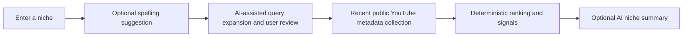

# NicheRadar

NicheRadar is a portfolio project for researching a YouTube Shorts niche before committing to create in it. It turns recent public metadata into a reviewable search plan, ranked Short candidates, deterministic performance signals, and an optional AI-written summary.

The live-analysis environment is maintained as private owner-only staging. This repository contains the application source and never contains API keys, database exports, or real user data.

## What it does

- Checks an entered niche for a high-confidence likely spelling error without silently changing the user's input.
- Uses Groq to propose focused search angles, then lets the user edit and approve up to ten queries.
- Collects recent public YouTube Shorts metadata, removes duplicates, and returns up to 50 ranked candidates.
- Reorders the completed result set in the browser by Views/day, Total views, or Subscriber multiplier without consuming additional API quota.
- Calculates deterministic Breakout, Exceptional, Virality Score, Confidence Score, and New-Creator Signal indicators.
- Generates an optional Groq niche summary from completed statistics; a failure never prevents the dashboard from loading.

## Method



Groq is assistive only: it helps with spelling suggestions, query expansion, and explaining completed analysis facts. Ranking and scoring are deterministic and do not depend on AI output.

## Boundaries

NicheRadar uses public metadata returned by the YouTube Data API. It does not analyse video frames, audio, transcripts, watch time, retention, or private channel data. Results are time-bound and query-dependent; they are research support, not guarantees of growth, virality, income, or future performance.

The current public-facing purpose is source review and portfolio presentation. Do not make a real-data interactive deployment broadly available until the relevant YouTube API policy, attribution, privacy, and derived-metrics requirements have been completed.

## Stack

- Python 3.13, FastAPI, Uvicorn, SQLAlchemy, and Alembic
- SQLite for local development; PostgreSQL via Neon for deployed staging
- YouTube Data API v3 for public metadata
- Groq for assistive AI features
- Plain HTML, CSS, and JavaScript frontend served by FastAPI
- Vercel Preview deployments and a Podman/Docker-compatible local container

## Local setup

From the project root in PowerShell:

```powershell
py -3.13 -m venv .venv
.\.venv\Scripts\Activate.ps1
python -m pip install -r requirements-dev.txt
Copy-Item .env.example .env
```

Set local values in `.env`:

```dotenv
YOUTUBE_API_KEY=your_youtube_key
GROQ_API_KEY=your_groq_key
DATABASE_URL=sqlite:///data/nicheradar.db
APP_ENV=development
APP_MODE=local
```

Never commit `.env` or any credential.

Apply migrations, then start the app:

```powershell
python -m nicheradar.init_db
python -m uvicorn nicheradar.api:app --reload
```

Open:

- Application: <http://127.0.0.1:8000>
- API documentation: <http://127.0.0.1:8000/docs>
- Health check: <http://127.0.0.1:8000/api/health>

## Command-line analysis

The command-line workflow uses the same query-expansion and YouTube-analysis pipeline, with an interactive query review:

```powershell
python -m nicheradar.analyze "AI productivity"
```

Optional collection and display limits range from 1 to 50:

```powershell
python -m nicheradar.analyze "AI productivity" --search-limit 50 --result-limit 50
```

## API endpoints

| Method | Path | Purpose |
| --- | --- | --- |
| `GET` | `/api/health` | Confirms that the application is running without calling YouTube or Groq. |
| `POST` | `/api/niche-spelling` | Returns an optional high-confidence spelling suggestion before expansion. |
| `POST` | `/api/queries` | Generates focused search queries for a niche. |
| `POST` | `/api/query-relevance` | Checks manually changed queries for relevance. |
| `POST` | `/api/analyses` | Collects metadata and returns a complete niche analysis. |
| `POST` | `/api/analysis-summary` | Returns optional Groq observations from completed facts and a deterministic New-Creator Signal; it never reruns collection. |

## Run with containers

Create `.env` as above, then run:

```powershell
podman compose up --build
```

The local compose configuration binds the app to `127.0.0.1:8000` and persists SQLite data in the `nicheradar-data` volume.

## Verification

```powershell
.\.venv\Scripts\python.exe -m pytest
.\.venv\Scripts\python.exe -m ruff check .
.\.venv\Scripts\python.exe -m ruff format --check .
node --test frontend/tests/*.test.cjs
```

## License

NicheRadar is licensed under the [GNU GPLv3](LICENSE).
